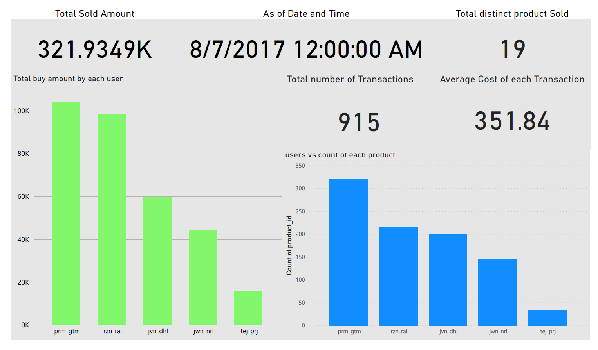

# Data Visualization
In this section we are trying to represent our models from database or other sources into a graphical representation. The grahical representation helps in decision making and other business ideas. The data is visualized so that the number are represented in a pictorail view for easy and better understanding for non techincal personnels as well.

# Actions taken in the making of Data Visualization
Here, we are provided with dump data which contains three tables- customer, products and sales. These are the steps taken while visualizing the data.
- First, the data source is connected to the Power BI.
- Secondly, Transformation is carried out if needed. We have preety clean data so we do not need any further data transforamtion process.
- At last, the connecetd data is visualized using different graphs, numbers and other.

# Steps taken to create our Visualization and its meaning
The below figure shows basic information about the sold amounts and basic data related to those transactions.
- The first field card which shows total sold amount which is calculated by using net bill amount and taking all sum of those transactions taken. 
- The second field is data of transactions taken. Here we have only one transactions so we have taken the date, otherwise we would have taken some type of line chart for the date range.
- The third field is also a card which shows total number of distinct product that has taken place at that specific date.
- The fourth field is also another card, which shows total number of transaction on that day.
- Another field is also anothet card, which shows avergae cost of each transaction. Here, currency is not given in data table, so that can be chaged according to the business needs.
- The other two graphs shows total buy amount by each customer and buy of each product by each customer on that specific day.
