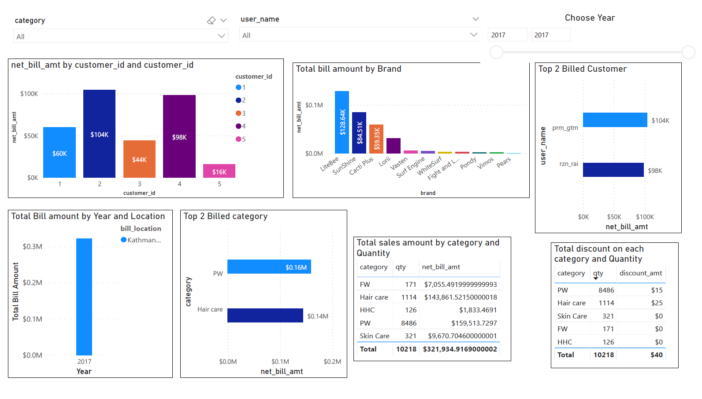

# Data Visualization - Day 2
In this session we have prepared data visulation using slicers and QA form in Power-BI. We are making dashboard as specified from the menotor and presented in the screenshot format.

## Actions taken in the making of Data Visualization
- We have used DAX code to find out the total discount on that spefic sale date. 
- We have changed the format of prices in dollar as we need to find out the unit of measurement.

## Steps taken to create our Visualization 
- we have used slicer for the Date, User name and category. We can use these slicers for data filtering and drill down approach in presentation.
- We are expected the data range from different dates, so we cannot find out the trendline for any measure on that date values.
- Top 2 billed customer and top 2 billed category are find out by using top N filter in the filter sestion for net bill amount.

